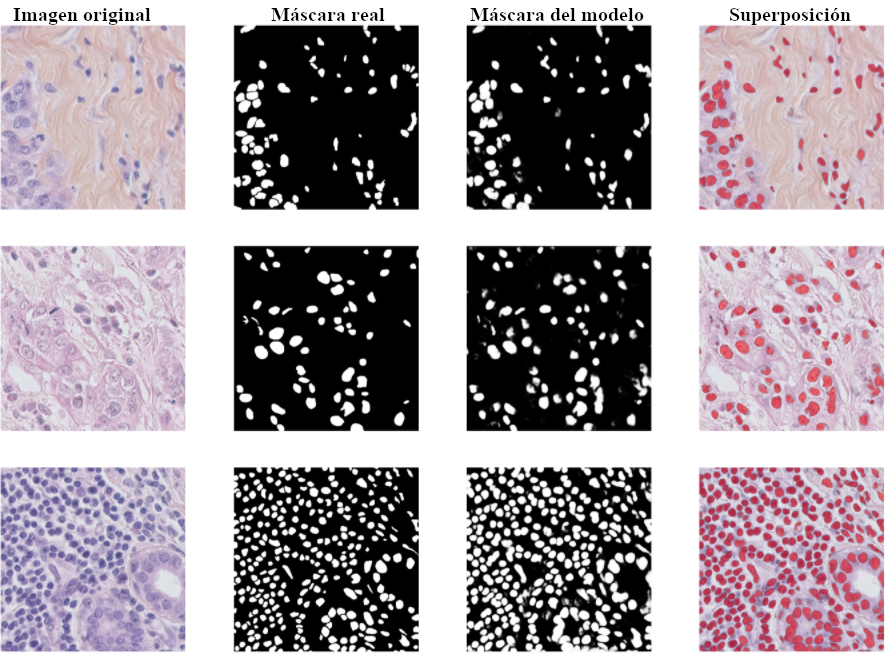

<h1 align="center">Deep Learning techniques for breast cancer detection 👋</h1>

  
    
  
  

> This repository contains the code for generate classification and segmentation models of my final degree project

### 🏠 [Homepage]()

## Usage

### IDC classification

Spyder is recommended for run code. Spyder is included by default in the Anaconda Python distribution.

1. Download [dataset](https://kaggle.com/paultimothymooney/breast-histopathology-images).
2. Modify `config/breast_histopathology_cancer_config.py` and set dataset path.
3. Run `delete_noisy_images.py` for delete noisy images.
4. Run `build_breast_histopathology_cancer.py`. Output files will be in HDF5 extension.
5. If you want to reproduce all experiments, run `scripts` in `models` folder (`train_*.py` files).
6. Models will be available in `output` folder.
7. Modify and run `test_model.py` for evaluate models.

### Cell nuclei segmentation

1. Download [dataset](https://zenodo.org/record/2579118#.X6VyvCyg-iP).
2. Run script `build_tnbc.py` for generate `.npy` files.
3. Upload `.npy` files to Google Colab.
4. Open `notebooks/Segmentación semántica.iypnb` in Google Colab. 
5. Models will save in your selected folder of Google Drive.

## Examples

Next picture shows IDC classification using VGG16 architecture:

  

If you run the notebook for nuclei segmentation problem, you will obtain a mask comparison of test dataset:

  

## Author

 👤 **Alejandro Jerónimo Fuentes**

- Website: https://ajf97.github.io/blog
- Github: [@ajf97](https://github.com/ajf97)
- LinkedIn: [@ajf97](https://linkedin.com/in/ajf97)

## 🤝 Contributing

Contributions, issues and feature requests are welcome! Feel free to check [issues page](https://github.com/ajf97/breast_histopathology_cancer/issues).

## Show your support

Give a ⭐️ if this project helped you!

## 📝 License

Copyright © 2021 [Alejandro Jerónimo Fuentes](https://github.com/ajf97). 
This project is [MIT](https://opensource.org/licenses/MIT) licensed.

---

_This README was generated with ❤️ by [readme-md-generator](https://github.com/kefranabg/readme-md-generator)_
